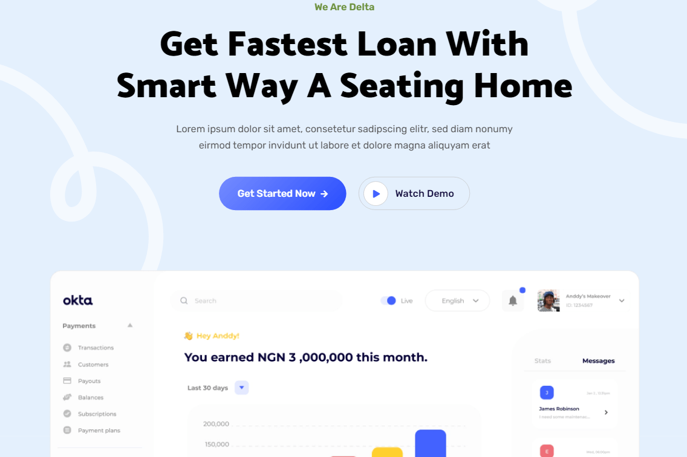

# DeltaThemeExplore_a

C:\me\ACTIVE\bsPUB\github.com\realB12\monster-gen\07_EXP\8_TEC\THEMES\Delta\a\DeltaThemeExplore_a\README.md

[content/english/about.md](content/english/about)

* **Owner**: rene.baron@baronsolutions.ch :: **Start**: 2021-08-21 :: **Status**: ongoing

* **Credentials**: -> [_underscore file](../_DeltaThemeExplore.md) (outside this project)

 

* [Official Documentation](documentation.html)

## Abstract 
`(for Decisions Makers)`

## Purpose and Goals to be achieved by this project

Goal of this Exploration project is to **understand** 

a) how the Theme is **setup** in general in terms of templates, archetypes, etc.

b) its **components** like for instancen the Disquos component

c) how this theme **integrates wie existing content files** (can we put on top, or do we have to copy/past content into the themes folder)
d) **hosting**: How to push this Example project on a Hosting Environment (Netlify, AWS)

### Out of Scope

## Issues
The following Issues have been found: 

### Hyperlinks
#### Problem
Hyperlink in the text such as [myfile](../myfile.md) do not work, because the Hugo compiler does not resolve them. This is a general issue that is not specific to the Theme but neither solved by it. #### Solution
Pragmatically we can write the URL link as [myfile](../myfile/). 
This solution works in the Website but breaks the MonsterGen experience for navigating in Markdown Docs. 

## Roadmap
See the open issues for a list of proposed features (and known issues).

## Installation
-> Project Setup for Hugo, Theme, GitHub, Netlify and Forestry see this folder's [_underscore file](../_DeltaThemeExplore.md), 

## Usage
Use this space to show useful examples of how a project can be used. Additional screenshots, code examples and demos work well in this space. You may also link to more resources.

For more examples, please refer to the Documentation

## Technical Stuff 
`(for Developers and Contributors`)

### Architecture
This section should list any major frameworks that you built your project using. Leave any add-ons/plugins for the acknowledgements section. Here are a few examples.

* Bootstrap
* GoLang
* HUGO
* Node
* NPM
* Webpack
* HTML 5.0

### Contributing
Contributions are what make the open source community such an amazing place to be learn, inspire, and create. Any contributions you make are greatly appreciated.

1. Fork the Project
2. Create your Feature Branch (git checkout -b feature/AmazingFeature)
3. Commit your Changes (git commit -m 'Add some AmazingFeature')
4. Push to the Branch (git push origin feature/AmazingFeature)
5. Open a Pull Request

## Getting Started
  
This is an example of how you may give instructions on setting up your project locally. To get a local copy up and running follow these simple example steps.
### Purpose

### Scope

### Documentation and Links

## Contacts

### Owner 
**René Baron, Zurich**
- [LinkedIn](https://www.linkedin.com/in/rene-baron/)
- [github](https://github.com/realB12 "Rene Baron on github")
- [Email](mailto:rene.baron@baronsolutions.ch?subject=Hi% "Hi!")
- [Website](https://myrasis.com "Welcome")

Project Link: https://github.com/your_username/repo_name

## Acknowledgements

## License
Distributed under the MIT License. See [LICENSE](LICENCE.md) for more information.